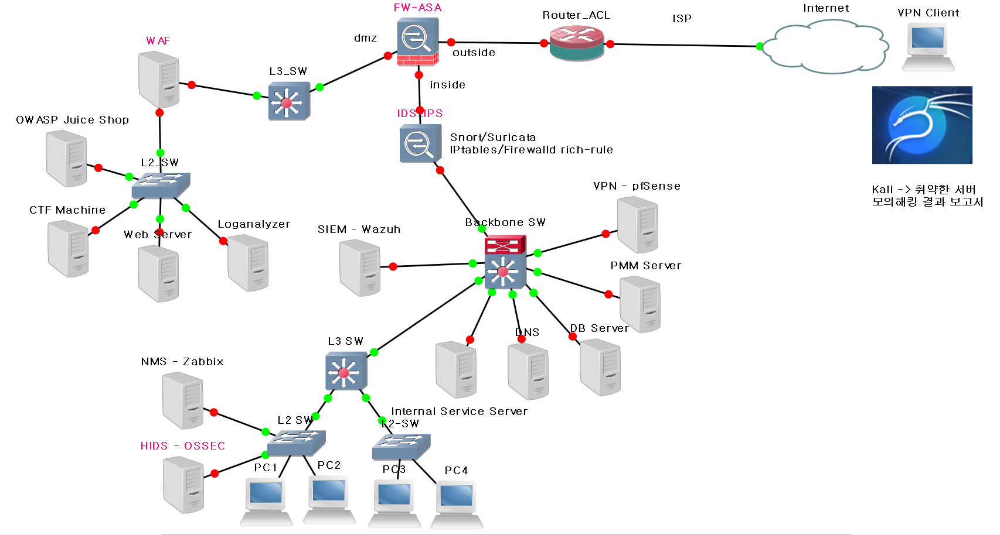
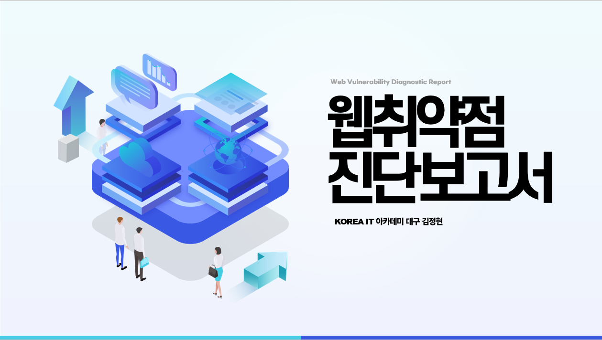

# 🛡️ 보안 인프라 구축 및 모의해킹 결과 보고서

## 🔍 프로젝트 개요

> **KOREAIT 아카데미 보안과정 중 개인 프로젝트로 진행한 보안 인프라 설계 및 구축 실습입니다.**

본 프로젝트는 실제 기업 환경을 모델링하여 **내부망 보안, 외부공격 방어, 침해 탐지 및 대응**을 위한 **네트워크 기반 보안 인프라**를 설계하고 구현한 것입니다. OWASP 취약점 실습, VPN 연결, SIEM 로그 수집 및 분석, IDS/IPS 탐지 시스템, Zabbix 기반 모니터링까지 다양한 기술 스택을 통합하여 구축했습니다. 또한 취약한 웹사이트를 분석하여 모의해킹 결과 보고서를 작성하였습니다.

---

## 🧩 전체 아키텍처 구성도

---

## 📝 모의해킹 결과 보고서

Wargame의 모의해킹결과 보고서는 [PDF 링크를 클릭하여 열 수 있습니다](https://github.com/JeongHyeon96/Security_Infrastructure_Architecture/blob/main/%EB%AA%A8%EC%9D%98%ED%95%B4%ED%82%B9%EA%B2%B0%EA%B3%BC%EB%B3%B4%EA%B3%A0%EC%84%9C_%EA%B9%80%EC%A0%95%ED%98%84.pdf)

---

## ⚙️ 주요 구성 요소 및 역할

| 구성 요소         | 설명 |
|------------------|------|
| **FW-ASA**       | 내부/외부망 트래픽 제어 및 DMZ 영역 분리, 방화벽 역할 수행 |
| **Router (ACL)** | 접근 제어 목록을 통한 네트워크 경로 제어 |
| **IDS/IPS (Snort/Suricata)** | 네트워크 침입 탐지 및 차단, Firewalld 및 iptables rule 적용 |
| **WAF**          | 웹 애플리케이션 방화벽으로 OWASP Juice Shop 보호 |
| **SIEM - Wazuh** | 실시간 로그 수집 및 분석, 위협 탐지 및 알림 기능 수행 |
| **Log Analyzer** | 웹 로그 분석 시스템 (Loganalyzer) |
| **HIDS - OSSEC** | 내부 PC들에 대한 호스트 기반 침입 탐지 적용 |
| **NMS - Zabbix** | 시스템 및 네트워크 모니터링, 트래픽 감시 |
| **CTF Machine**  | 모의해킹 실습용 환경 |
| **VPN - pfSense**| 외부에서 내부 네트워크로 안전한 접근을 위한 VPN 서버 |
| **PMM Server**   | 서버 성능 모니터링 도구, DB 및 애플리케이션 성능 추적 |
| **DNS/DB Server**| 내부 네트워크 서비스 제공을 위한 핵심 인프라 |
| **Internal PC (PC1~4)** | 일반 사용자 환경, OSSEC 적용 대상 |
| **Web Server**   | OWASP Juice Shop 및 CTF 서비스 제공 |
| **Kali Linux**   | 취약 서버 대상 모의해킹 도구로 사용 |
| **Backbone SW / L3/L2 SW** | 네트워크 트래픽 분산 및 VLAN 분리 구현 |

---
## 🛠️ 사용 기술 스택

- **네트워크**: VLAN, Routing, ACL, L2/L3 Switching, DMZ, VPN
- **방화벽 및 IDS/IPS**: Cisco ASA, Snort, Suricata, iptables
- **SIEM/로그 분석**: Wazuh, OSSEC, Loganalyzer
- **모니터링**: Zabbix, PMM
- **보안 실습 환경**: OWASP Juice Shop, CTF Machine, Kali Linux
- **운영체제**: Rocky Linux 8.10, Ubuntu 24.04, pfSense

---

## 🎯 프로젝트 목표 및 결과

- 🔒 내부망과 DMZ 분리로 보안 경계 구축
- 🛡️ WAF 및 IDS/IPS 설정으로 웹/네트워크 공격 탐지
- 🔎 SIEM 도입으로 로그 기반 위협 분석 체계화
- 🧪 Kali를 활용한 모의해킹을 통한 취약점 보고서 생성
- 📊 Zabbix/PMM 기반 리소스 및 성능 모니터링 구현

---

## 📝 개인 수행 내역

- 전체 네트워크 인프라 설계 및 GNS3 시뮬레이션 구축
- ASA 방화벽 및 pfSense VPN 구성
- Snort + Suricata + iptables 조합 IDS/IPS 구성
- Wazuh SIEM + OSSEC 연동 및 모니터링 대시보드 설정
- Kali Linux로 취약 시스템 모의 해킹 및 결과 보고서 작성

---

